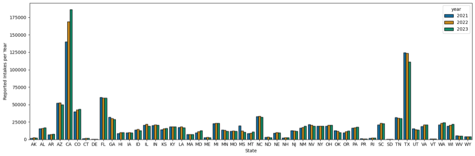
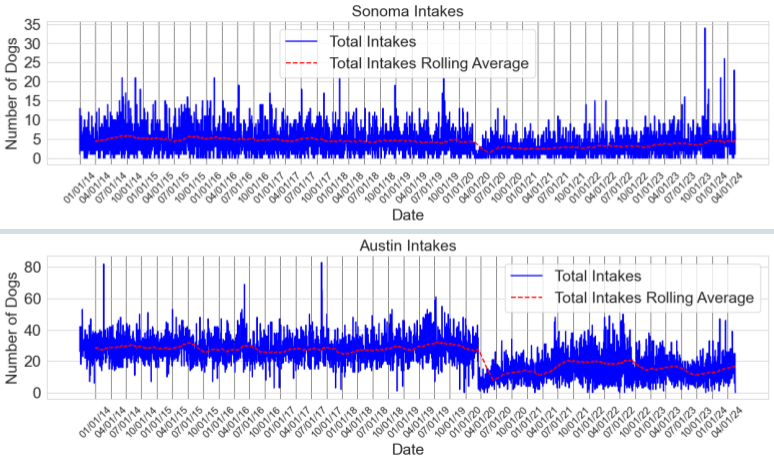
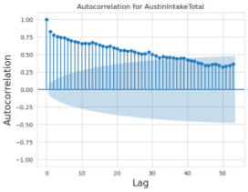
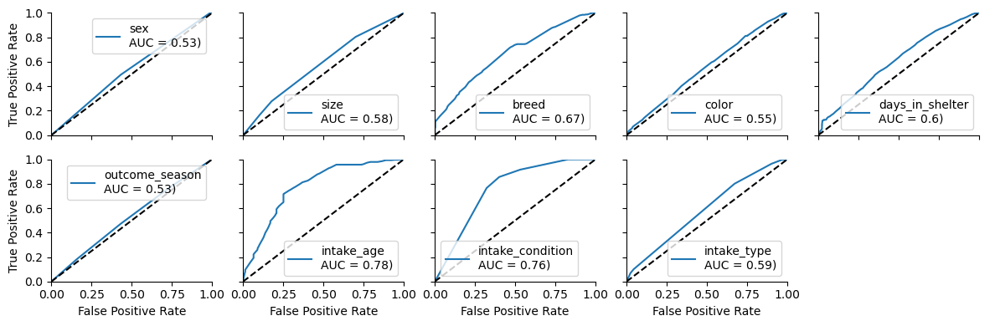
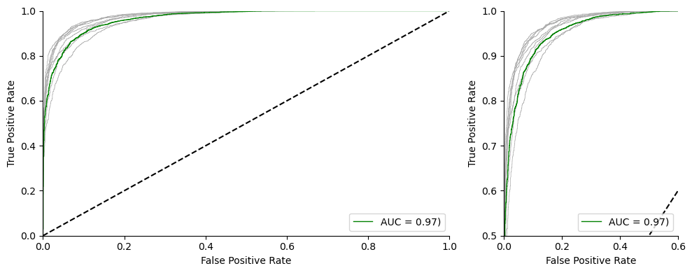
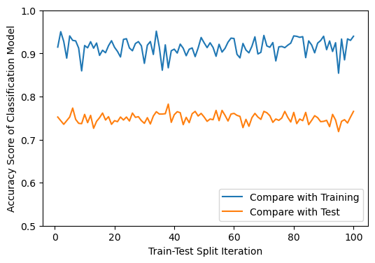

# Doggy Doggy! ... what now?

## The Project

The main question posed by our group is whether one can predict the rates of intake and/or adoption of dogs in animal shelters based on certain socioeconmic or cultural criteria.

### Macro-Level Data: 
A three-year aggregate of data was collected from The Shelter Animals Count: The National Database (https://www.shelteranimalscount.org) collected for all 50 states and Puerto Rico.

### Metro-Level Data: 
Data from multiple metropolitan locations were collected and cleaned. In particular:
- Sonoma County, California
- Austin, TX
- Bloomington County, Indiana
- Lexington, KY

### Additional Factors
A series of socioeconmic and cultural touchstones were explored to improve our modeling efforts. These include:
- Unemployment
- Stock prices
- Popular media (e.g. programs such as 'Bojack Horseman' or 'Bluey')
- Seasons and temperature
and more.

## The Modeling

The project team started from a 3-year aggregration of data to ascertain particulars about animal shelters, particularly surrounding the intake and outcome of dogs with respect to adoptions. Exploratory data analysis led the team to consider both time-dependent and time-independent modeling to best predict factors surrounding adoptions and when to determine changes in intake and/or outcome behaviors.

###  Time Dependent Modeling

Modeling efforts to predict when to expect intakes or outcomes to best assist animal shelters were conducted, with highlights of data below.

### Time *Independent* Modeling

Modeling efforts to predict likelihood of dog adoption based on features of the animal intake as well as season of adoption were conducted, with highlights of data below. Use of the Sonoma County data allowed us to develop random forest models via categorical boosting with CatBoost. Determining an ideal decision tree depth of 6, modeling with a classifier resulted in a model that depends of features `intake_age`, `intake_type`, `size`, `outcome_season`, and `days_in_shelter`. The figures below show individial ROC graphs for each possible feature, the ROC curve of the final CatBoostClassifier() model, and looking at the accuracies of the model between the training and test data.

### Glossary of Terms
The compiled list are words/phrases that data scientists commonly ran into during this project. Please refer to this list as you navigate this repository. 
- *Intake*: The factors in which a dog has been placed into an animal shelter.
    - factors include: strays and/or abandoned dogs; public assistance; owner surrender (multiple reasons)

- *Outcome*: The factors in which a dog has left an animal shelter.
    - factors include: adopted; returned to owner; lost or stolen; euthanized

## Project Information

This is the data and programming repository associated with the May 2024 Erdos Bootcamp project nicknamed "Doggy-Doggy-What-Now".

###  Team Members 

- John P. Harden
- Angela Kubena
- Jun Bo Lau
- Claire Merriman 
- Robert Young

*mentor: Evelyn Huszar*

### Technical Aspects

Any programming that was conducted with Python3 in live-kernal notebooks utilized the `erdos_may_2024` conda environment build. You can find the most recent Conda environment file in `assets`/

Any additional Python3 packages required for this project can be found below.
- CatBoost (https://catboost.ai, v. 1.2.3): downloaded and used during classification modeling (*yes, we see the irony of using cats on a dog-centered project*)

### 

Are you interested in getting a dog of your own? Please visit your local animal shelter. 
Not sure how to start? Visit this link to the ASPCA search engine to find dogs near you (https://www.aspca.org/adopt-pet/adoptable-dogs-your-local-shelter)
